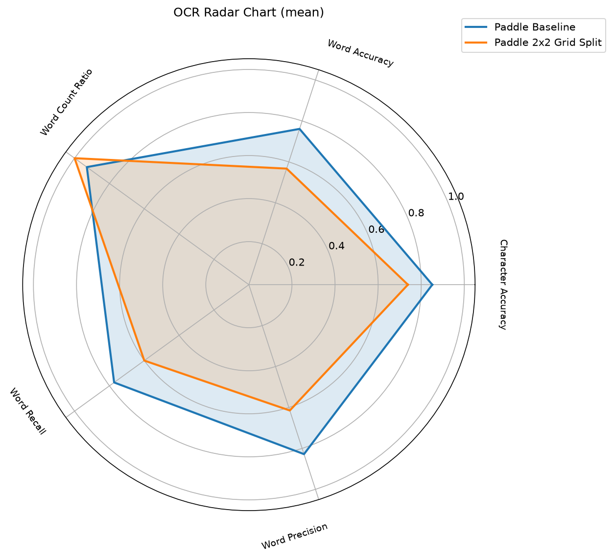
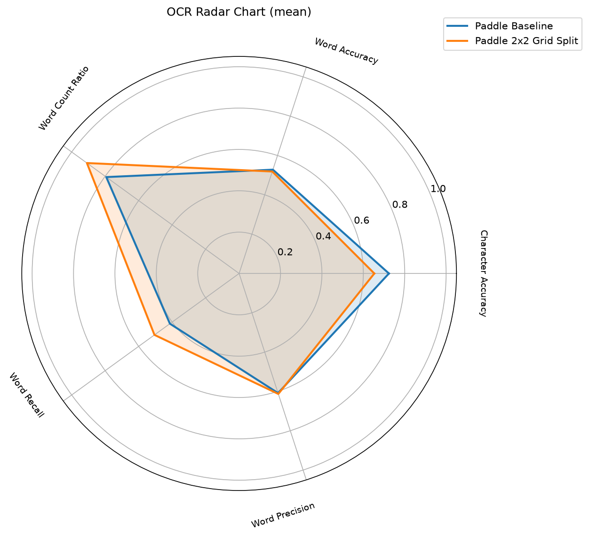

# OCR-Toolkit

This toolkit aims to create a unified "one-stop-shop" framework for integrating, benchmarking, and comparing OCR 
engines. It aims to provide a seamless and clean interface to integrate multiple OCR engines for common and uncommon 
OCR tasks. The OCR-Toolkit cleanly decouples the OCR engine, preprocessing pipeline, and the evaluation metrics into interchangeable
components allowing easy tinkering and experimentation for OCr configuration and engine evaluation. Using the toolkit 
Integrating a new OCR engine requires one subclass with one method and the framework handles plugging image 
preprocessing, coordinate remapping, metric computation, and result persistence automatically.

## Introduction

Selecting the optimal OCR engine and configuration for a given input type is
largely trial and error experiment. Different engines, preprocessing pipelines, and
parameter choices can yield vastly different results, yet there is no
standardized method for quantifying those differences across a dataset.
OCR-Toolkit replaces intuition with data: execute the pipeline, examine the
metrics, and let confidence intervals, per-tag breakdowns, and side-by-side
plots identify the optimal combination. It then allows copying the successful configuration 
to production with no additional harness and a lightweight installation.

## Use Cases

- Compare multiple OCR engines on the same dataset under identical conditions.
- Measure the impact of a preprocessing step (e.g. contour splitting vs. grid
  splitting) on recognition accuracy.
- Integrate a new OCR engine with minimal boilerplate and immediately benchmark
  it against existing solutions.
- Create and maintain ground-truth annotations using the included tagging tool.
- Make data-driven decisions about OCR configuration rather than relying on
  manual inspection.

## Example: Compare OCR Configurations in One Command

The fastest way to see what OCR-Toolkit can do: **two JSON files, one command,
and a data-driven answer.** The `examples/` directory ships a ready-to-run
comparison that asks a typical question -- *does splitting an image into a 2x2
grid improve PaddleOCR?* -- and answers it across 70 real-world images.

### Compare configurations

Start with the baseline -- `examples/paddleocr_baseline.json` runs PaddleOCR with
its stock pipeline:

```json
{
    "alias": "Paddle Baseline",
    "model_name": "PaddleOCRModule",
    "model_params": {
        "lang": "en",
        "use_doc_orientation_classify": false,
        "use_doc_unwarping": false,
        "use_textline_orientation": false
    },
    "preprocess_methods": []
}
```

Now compare it to a configuration that is *exactly the same, plus one key* --
`examples/paddleocr_split_image.json` adds a single `preprocess_methods` entry to
split every image into a 2x2 grid before recognition. The diff is just:

```json
 {
    "alias": "Paddle 2x2 Grid Split",
    ...
    "preprocess_methods": [
        {"name": "grid_split_image", "kwargs": {"grid": [2, 2]}}
    ]
 }
```

The toolkit handles the rest -- running each cell through the engine and
remapping the detections back to the original image coordinates automatically.
Testing any other preprocessing idea (contour splitting, binarization, custom
steps) is the same one-line change -- no engine or pipeline code to touch.

### Running the comparison

Run both configurations against the 70-image dataset in one shot:

```bash
python -m scripts.run_evaluation \
    --config examples \
    --dataset dataset \
    --output-dir scripts/results
```

The pipeline computes character accuracy, word accuracy, word recall, word
precision, and word count ratio -- with per-image results, confidence
intervals, and comparison plots for every configuration in the directory.

### Automatic Report Generation

In this example the baseline wins on average across all images: grid-splitting reduces accuracy and
precision while detecting more (spurious) words. On natural-scene text the
picture flips -- the grid-split recovers words the baseline misses, lifting
word recall roughly 9 points at essentially no precision cost:

<table>
  <tr>
    <td align="center">
      
      <br />
      <em>All images: baseline is more accurate</em>
    </td>
    <td align="center">
      
      <br />
      <em>Natural scenes: grid split recovers more words</em>
    </td>
  </tr>
</table>

One command, two configs, and the trade-off is quantified.

## Features

- **Unified OCR interface** -- integrate any OCR engine by subclassing
  `OCRAbstract`. Ships optionally with EasyOCR, PaddleOCR, and pytesseract
  example implementations.
- **Modular preprocessing** -- composable preprocessing pipeline supporting
  grid splitting, contour-based segmentation, binarization (adaptive and Otsu),
  and user-supplied steps. Combine stages via configuration or code to build the
  pipeline that fits your input data.
- **Evaluation pipeline** -- compute character accuracy, word accuracy, word
  recall, word precision, and word count ratio against ground-truth
  annotations, with per-image and aggregate results including confidence
  intervals and supporting visualizations
- **Tagging tool** -- browser-based Flask UI for creating and editing
  ground-truth bounding-box annotations.

## Versioning

Current version: **1.0.0** (released 2026-09-06).

## Installation

Requires Python 3.12+.

The project ships three independent optional dependency groups on top of the
always-installed base. Pick any subset, combine them, or use `full` for
everything.

**Base** (core abstractions, evaluation primitives, no engines, no app):

```bash
pip install -e .
```

**OCRs** (all OCR engines: EasyOCR, PaddleOCR, PaddlePaddle, pytesseract):

```bash
pip install -e ".[ocrs]"
```

> Note: `pytesseract` also requires the system `tesseract` binary, e.g.
> `sudo apt-get install -y tesseract-ocr` on Debian/Ubuntu.

**Dataset Tagging App** (Flask UI plus its end-to-end test deps):

```bash
pip install -e ".[dataset-tagging-app]"
```

**Developer** (ruff, pytest, pre-commit):

```bash
pip install -e ".[dev]"
pre-commit install
```

**Full** (all groups above):

```bash
pip install -e ".[full]"
```

Combinations are supported, e.g. `pip install -e ".[ocrs,dev]"`.

All code style is enforced by [Ruff](https://docs.astral.sh/ruff/) via
pre-commit hooks. After `pre-commit install`, every commit is automatically
checked (lint + format). The ruff configuration lives in `pyproject.toml`
under `[tool.ruff]`.

## Project Structure

```
ocr_backbone/       Core abstractions: OCRAbstract, OCRConfig, OCRResult, BoundingBox, InputImage
ocr_modules/        Concrete OCR engine implementations (EasyOCR, PaddleOCR, pytesseract)
evaluation/         Evaluation pipeline, metrics, ground truth, and plotting utilities
utils/              Shared utilities (JSON I/O, dataset loading, statistics, serialization)
scripts/            CLI tools: run_evaluation, draw_bboxes, tagging tool
dataset/            Local dataset with images/ and ground_truth/ subdirectories
tests/              Unit, regression, and application tests
```

## Usage

### Run Evaluation

Execute all registered OCR modules against the dataset and generate metrics
and plots:

```bash
python -m scripts.run_evaluation [--config config.json] [--dataset path/to/dataset] [--output-dir scripts/results]
```

- `--config` accepts a single JSON config file or a directory of JSON configs.
  Without it, all registered OCR modules are evaluated with default settings.
- `--dataset` defaults to the built-in `dataset/` directory. The directory must
  contain `images/` and `ground_truth/` subdirectories with matching stems.
- `--output-dir` defaults to `scripts/results`.
- `--overwrite` re-runs OCR even when cached per-image results already exist.

Results are saved as JSON files and PNG plots (bar chart, radar, range plot).

### Tagging Tool

Launch the browser-based annotation UI:

```bash
python -m tagging_tool [--port 5000]
```

Opens `http://localhost:5000` in the default browser.

### Draw Bounding Boxes

Overlay persisted OCR results on an image:

```bash
python -m scripts.draw_bboxes <image_path> <results_json>
```

Produces `<image_stem>_with_bounding_box.<ext>` in the same directory.


## Configuration

OCR runs are configured via `OCRConfig`, which can be loaded from a JSON file.
A minimal configuration requires only `model_name` and `model_params`:

```json
{
    "model_name": "EasyOCRModule",
    "model_params": {}
}
```

A full configuration can include preprocessing steps and a bounding-box
validator:

```json
{
    "model_name": "EasyOCRModule",
    "model_params": {"languages": ["en"]},
    "preprocess_methods": [
      {"name": "contour_split_image"}
    ]
}
```

Preprocessing method names are resolved from `ocr_backbone.image_preprocessing`
by default. Dotted paths (e.g. `"my_package.module.func"`) are dynamically
imported. Optional `"kwargs"` are bound via `functools.partial`.

## Adding a New OCR Module

Subclass `OCRAbstract` and implement `_run_single`:

```python
from ocr_backbone.ocr_abstract import OCRAbstract
from ocr_backbone.ocr_result import OCRResult


class MyOCRModule(OCRAbstract):
    def __init__(self, config):
        super().__init__(config)
        # initialize your engine

    def _run_single(self, image, single_run_model_params):
        # run inference, return OCRResult
        ...
```

The subclass is auto-registered by class name and becomes available to
`OCRAbstract.from_config` and the evaluation pipeline.

## License

MIT -- see [LICENSE](LICENSE).
